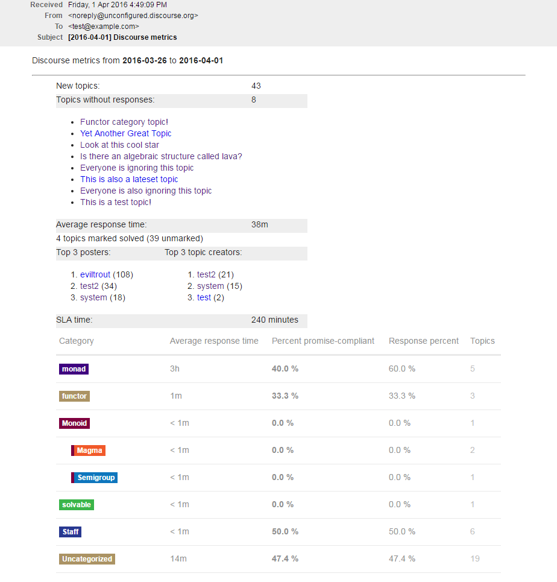

## Discourse metrics reporting

A plugin built for the Discourse stack that sends weekly emails regarding topic and user metrics.

### Installation

* Follow the [standard procedure](https://meta.discourse.org/t/install-a-plugin/19157) for plugin installation  
* For non-Docker instances, clone this into your `plugins` folder and restart Rails and Sidekiq  

### Features  

This plugin was developed with the intent of:

* helping teams that promise to comply to an SLA response time assess their compliance  
* helping managers assess usage of an internal Discourse instance across a department  

That being said, the following per-week metrics are currently sent in a weekly email blast: 

* Count of new topics
* Count and list of topics without any posts in reply  
* Average time for someone to first reply to a topic  
* Count of topics marked [solved](https://meta.discourse.org/t/discourse-solved-accepted-answer-plugin/30155)  
  - this plugin should still work without the discourse-solved plugin  
* List of the top *n* most active posters  
* List of the top *n* most active topic creators  
* A *per-category* table (with nested subcategories) showing:  
  - Average time for first topic reply  
  - Percent of topics that are replied to within the SLA agreed time  
  - Percent of topics with any replies at all  
  - Total number of topics  

### Troubleshooting

Look for configuration settins prefixed with `weekly email report` in your `/admin/site_settings/category/plugins`.  A good place to start if you are having issues is to check through this list : 

* Did you change the value of `weekly email report time of day`?
  - You must restart Sidekiq for the job schedule to change  
* Are you receiving emails at the wrong time?
  - See the point above  
  - Sidekiq sees `weekly email report time of day` in its timezone. Are you in the same timezone?
  - Did you format `weekly email report time of day` or spell `weekly email report day of week` incorrectly?  
    - The plugin reverts to a default value if these are incorrect  
* Did you receive two emails at once?  
  - This is normal and can happen when you initially restart the server after installing the plugin.  Doing this helps you detect if there is some other problem  
* Are you receiving no emails at all?  
  - Are your [SMTP settings correct?](https://meta.discourse.org/t/troubleshooting-email-on-a-new-discourse-install/16326/2)
  - Did you set `weekly email report recipeints`?
    - If you changed this *after* restarting Sidekiq, they will not receive the initial emails.  This is okay, they should still receive them starting the next week  
  - [MailCatcher](https://github.com/sj26/mailcatcher) helps

Every setting except for `weekly email report time of day` can be changed by an admin user without the need to restart the server.

### Example

Here is a sample report (viewed with MailCatcher):

